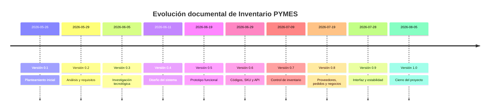

# Cronología general del proyecto

Fecha de elaboración: 5 de agosto de 2026

Organizamos esta cronología como una reconstrucción documental. La usamos para ordenar el avance entre el 26 de mayo y el 5 de agosto de 2026 sin afirmar que cada actividad ocurrió históricamente en esa fecha exacta. El respaldo técnico viene del estado final del repositorio, del historial Git y de los comandos ejecutados durante la revisión.

## Línea general

| Versión | Periodo | Trabajo documentado | Resultado de la etapa |
|---|---|---|---|
| 0.1 | 26 al 28 de mayo | Planteamiento | Identificamos el problema y el alcance inicial. |
| 0.2 | 29 de mayo al 4 de junio | Requisitos | Definimos actores, requisitos y reglas de negocio. |
| 0.3 | 5 al 10 de junio | Investigación | Comparamos alternativas de aplicación, persistencia, códigos y pruebas. |
| 0.4 | 11 al 18 de junio | Diseño | Propusimos arquitectura, pantallas, datos y flujos. |
| 0.5 | 19 al 28 de junio | Prototipo | Dejamos la base de aplicación, navegación y registro manual. |
| 0.6 | 29 de junio al 8 de julio | Código, SKU y API | Incorporamos búsqueda por código, consulta externa y reglas de duplicados. |
| 0.7 | 9 al 18 de julio | Inventario | Integramos entradas, salidas, ajustes, movimientos, conteos, lotes y caducidades. |
| 0.8 | 19 al 27 de julio | Proveedores, pedidos y negocios | Agregamos proveedores, pedidos, recepciones y soporte parcial por negocio. |
| 0.9 | 28 de julio al 4 de agosto | Interfaz y estabilidad | Ajustamos navegación, menú, responsividad y pruebas de regresión. |
| 1.0 | 5 de agosto | Cierre | Confirmamos estado final, compilación, pruebas y pendientes. |

## Timeline

## Continuidad entre etapas

En las primeras versiones trabajamos más con problema, alcance y requisitos. Después pasamos al diseño y al prototipo. Las versiones intermedias incorporaron las reglas que hoy sí aparecen en el código: códigos, SKU, API, movimientos, lotes, caducidades, pedidos y conteos. En la última parte revisamos interfaz, estabilidad, compilación y pruebas.

Lo que quedó parcial desde etapas anteriores se mantuvo visible hasta el cierre: multiempresa completa, seguridad de usuarios y un proyecto de pruebas de interfaz. El escaneo por cámara y la validación de dígito verificador se incorporaron en el flujo técnico. En Windows verificamos el botón, la apertura del escáner y el inicio de captura; quedó pendiente decodificar un código físico y repetir la validación en Android y con una webcam USB identificada.
