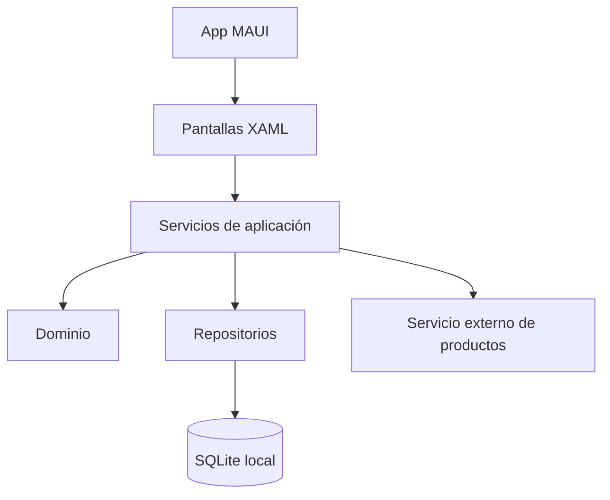
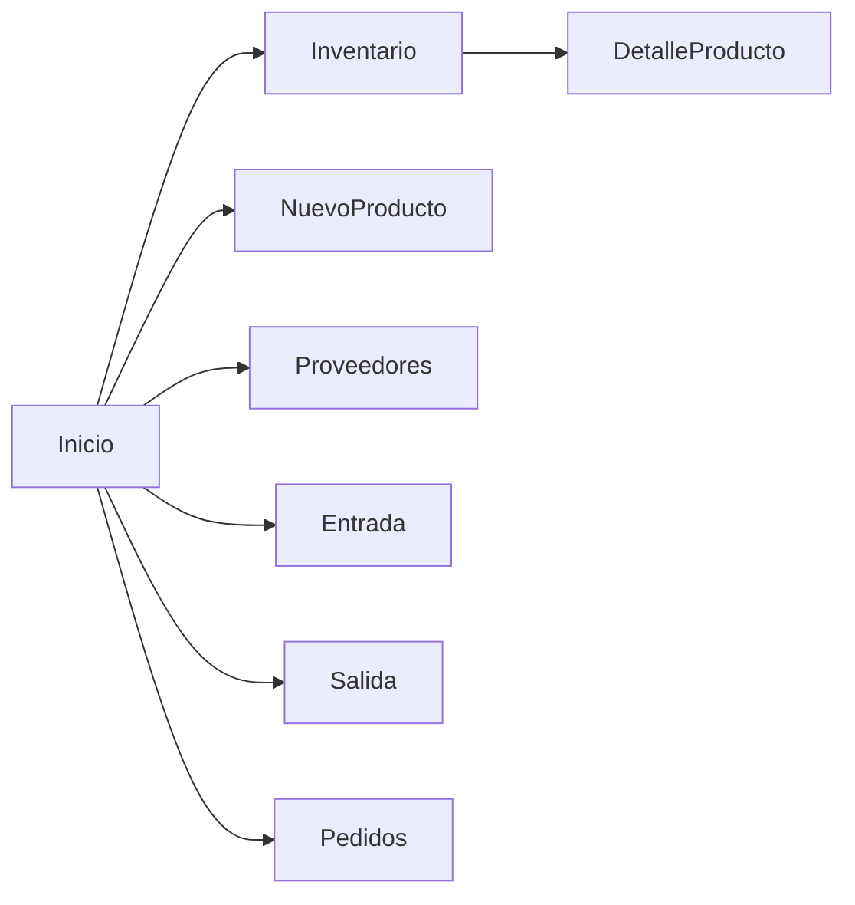

# Arquitectura propuesta

Fecha documentada: 11 de junio de 2026  
Versión relacionada: 0.4

Documento reconstruido a partir de las evidencias actuales del proyecto.

## Qué buscábamos

En esta etapa diseñamos una arquitectura antes de considerar el sistema terminado. Queríamos evitar que la interfaz hablara directamente con la base de datos y queríamos separar reglas de inventario de las pantallas.

## Componentes propuestos

## Capas previstas

- Interfaz: pantallas y navegación.
- Servicios: operaciones de productos, inventario, proveedores y pedidos.
- Dominio: entidades y reglas.
- Infraestructura: base local, repositorios y API externa.
- Pruebas: validación de reglas.

## Navegación propuesta

Propusimos un menú lateral con accesos a inicio, inventario, productos, proveedores, entradas, salidas y pedidos. La evidencia final confirma Shell/Flyout en `AppShell.xaml`.

## Modelo de datos propuesto

Diseñamos entidades para negocio, producto, proveedor, movimiento, lote, conteo, pedido y recepción. En esta fecha documental todavía no las presentamos como implementadas.

## Validaciones propuestas

- SKU obligatorio.
- Código único cuando exista.
- Cantidad positiva.
- Fecha de caducidad cuando aplique.
- No confundir pedido con entrada.
- No modificar stock sin movimiento.

## Recomendación futura desde esta etapa

El diseño debía revisarse al implementar el prototipo, porque algunas relaciones, como lotes y recepciones, podían cambiar cuando se escribieran las reglas reales.

