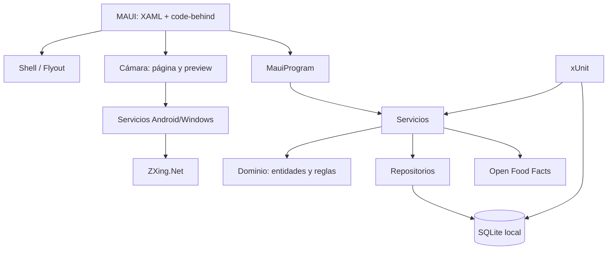

# Arquitectura final

Fecha de revisión: 5 de agosto de 2026

Documento reconstruido a partir de las evidencias actuales del proyecto.

## Estado real

Al cierre encontramos una aplicación local .NET MAUI. No encontramos backend separado. La interfaz consume servicios internos, los servicios aplican reglas y los repositorios escriben en SQLite.

## Diagrama final

## Responsabilidades reales

| Parte | Responsabilidad | Evidencia |
|---|---|---|
| `AppPages/` | Pantallas, formularios y navegación de usuario | XAML y code-behind |
| `AppShell.xaml` | Menú lateral y rutas principales | Shell/Flyout |
| `MauiProgram.cs` | Inyección de dependencias | Registro de servicios y páginas |
| `Controls/` y `Services/` | Vista previa de cámara, coordinación de escaneo y abstracción compartida | `BarcodeCameraPreview.cs`, `BarcodeScannerCoordinator.cs`, `IBarcodeCameraScannerService.cs` |
| `Platforms/Android/` | Integración de cámara Android | Camera2, `TextureView`, `ImageReader`, permiso `CAMERA` |
| `Platforms/Windows/` | Integración de cámara Windows | `MediaCapture`, `MediaFrameReader`, capacidad `webcam` |
| `InventorySystem.Domain` | Entidades, enums y reglas | `InventoryModels.cs` |
| `InventorySystem.Infrastructure` | Datos, repositorios, servicios y API | `src/InventorySystem.Infrastructure/` |
| `tests/` | Pruebas automatizadas | xUnit |

## Persistencia

Usamos SQLite local con migraciones manuales. `InventoryDatabase` administra transacciones y `DatabaseMigrator` crea tablas, índices y triggers.

## Servicios

Encontramos servicios para negocio, dashboard, productos externos, búsqueda de productos, escaneo manual/HID/imagen, cámara por plataforma, inventario, ajustes, lotes, conteos y pedidos.

## API

La única API externa comprobada es Open Food Facts. No encontramos API propia ni backend remoto.

## Validaciones

Las reglas se reparten entre dominio, repositorios y servicios. Las más importantes son SKU obligatorio, duplicados, cantidades válidas, stock suficiente, caducidades, recepción idempotente y validación EAN/UPC/GTIN antes de consultar la API externa.

## Recomendación futura

Conviene separar más lógica de UI en ViewModels, agregar pruebas de interfaz, validar cámaras físicas específicas y registrar errores persistentes para diagnóstico.
