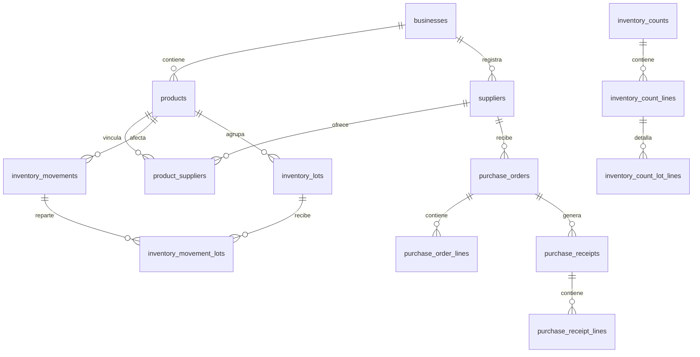

# Modelo de datos

Fecha de revisión: 5 de agosto de 2026

Documento reconstruido a partir de las evidencias actuales del proyecto.

## Estado real

El modelo se implementa en SQLite mediante `DatabaseMigrator.cs`. Las entidades de dominio están en `InventoryModels.cs`. Encontramos un modelo amplio para productos, proveedores, inventario, lotes, conteos, pedidos y recepciones.

## Entidades principales

| Tabla | Propósito | Llaves y relaciones relevantes |
|---|---|---|
| `businesses` | Negocios | PK `id` |
| `products` | Productos e inventario teórico | FK `business_id`; SKU y código únicos por negocio |
| `suppliers` | Proveedores | FK `business_id`; nombre único por negocio |
| `product_suppliers` | Relación producto-proveedor | FK producto/proveedor |
| `inventory_documents` | Documentos de entrada/salida | FK negocio |
| `inventory_document_lines` | Líneas de documento | FK documento/producto |
| `inventory_movements` | Historial de stock | FK negocio/producto/documento; protegido por triggers |
| `inventory_lots` | Lotes y caducidades | FK negocio/producto/proveedor |
| `inventory_movement_lots` | Relación movimiento-lote | FK movimiento/lote |
| `inventory_counts` | Sesiones de conteo | FK negocio/proveedor |
| `inventory_count_lines` | Diferencias por producto | FK conteo/producto |
| `inventory_count_lot_lines` | Diferencias por lote | FK línea/lote |
| `purchase_orders` | Pedidos | FK negocio/proveedor |
| `purchase_order_lines` | Conceptos de pedido | FK pedido/producto |
| `purchase_receipts` | Recepciones | FK pedido/negocio/proveedor; `operation_key` |
| `purchase_receipt_lines` | Conceptos recibidos | FK recepción/línea/producto |

## Diagrama simplificado

## Unicidad e integridad

Confirmamos unicidad de SKU y código por negocio, unicidad de proveedor por negocio, llaves foráneas, transacciones y triggers para movimientos inmutables.

## Stock

El stock actual se guarda en `products.stock_milli`. Las cantidades se manejan en milésimas para aceptar decimales. Cada entrada, salida, ajuste o recepción debe registrar movimiento.

## Lotes y caducidades

Los lotes guardan cantidad inicial, cantidad restante, proveedor, costo y caducidad. El consumo FEFO aparece en la persistencia de lotes.

## Negocios

El modelo soporta `business_id`, pero la administración completa de negocios desde interfaz sigue parcial.

## Modelo recomendado

Para una versión futura agregaríamos usuarios, roles, configuración por negocio, respaldo/exportación y posible sincronización remota.

