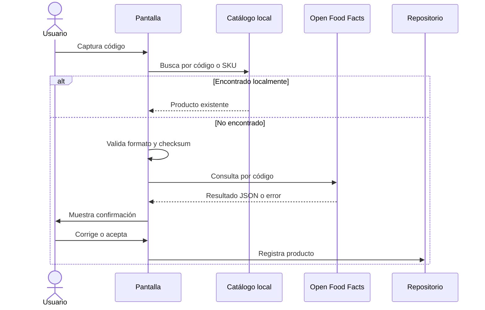

# Investigación: API de búsqueda de productos

Periodo documentado: 1 al 5 de julio de 2026

Documento reconstruido a partir de las evidencias actuales del proyecto.

## Problema que teníamos

Queríamos reducir la captura manual cuando el usuario escribiera o escaneara un código. La pregunta era si convenía consultar una fuente externa o depender solo del catálogo local.

## API real identificada

La API real es Open Food Facts (`ExternalProductService.cs`).

| Dato | Resultado |
|---|---|
| Nombre | Open Food Facts |
| Propósito | Buscar información de producto por código de barras. |
| Cliente HTTP | `HttpClient` |
| Solicitud | GET a `https://world.openfoodfacts.org/api/v2/product/{barcode}.json` |
| Respuesta | JSON con estado y objeto `product`. |
| Campos usados | `product_name_es`, `product_name`, `generic_name_es`, `generic_name`, `brands`. |
| Timeout | 8 segundos en el servicio. |
| Autenticación | No encontramos autenticación dentro del repositorio. |
| Límites | No encontramos esta información dentro del repositorio. |
| Validación previa | El código debe tener formato EAN/UPC/GTIN soportado y checksum válido antes de consultar la API. |

## Opciones revisadas

- Open Food Facts.
- UPCitemdb.
- Catálogo local.
- Registro manual.
- Servicios comerciales.

No inventamos endpoints, claves, precios ni planes. Solo Open Food Facts aparece implementado.

## Qué elegimos

Elegimos buscar primero en catálogo local y después consultar Open Food Facts si no había coincidencia (`ProductLookupService.cs`). Antes de enviar el código a la API, validamos longitud, caracteres numéricos y dígito verificador (`BarcodeRules`, `ExternalProductService.cs`).

## Manejo de errores

El servicio maneja timeout, errores HTTP, cancelación y JSON. Si el producto no aparece, el sistema permite captura manual. La confirmación del usuario evita guardar automáticamente un producto externo incorrecto.

## Consecuencias

La consulta externa ayuda, pero no reemplaza la revisión del usuario. En la siguiente versión conectamos esta identificación con movimientos de inventario.

## Referencias consultadas

| Título | Organización | URL | Fecha de consulta |
|---|---|---|---|
| Open Food Facts API documentation | Open Food Facts | https://openfoodfacts.github.io/openfoodfacts-server/api/ | 2026-08-05 |
| Consume a REST-based web service | Microsoft Learn | https://learn.microsoft.com/en-us/dotnet/maui/data-cloud/rest | 2026-08-05 |
