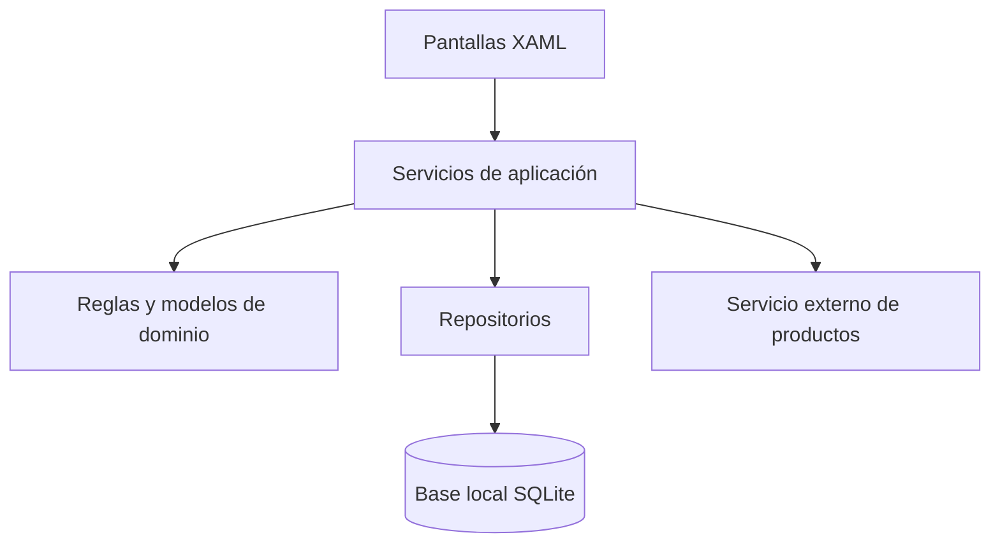
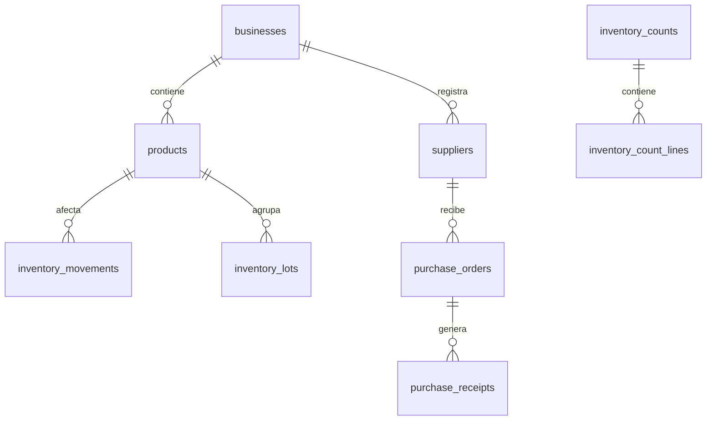

# Versión 0.4 — Diseño del sistema

Periodo de trabajo: 11 al 18 de junio de 2026  
Estado de la etapa: Diseño cerrado con pendientes  
Versión anterior: 0.3  
Siguiente versión: 0.5

## Situación al iniciar

Retomamos la investigación tecnológica y pasamos a un diseño previo al desarrollo. Todavía no podíamos presentar módulos terminados; lo importante era decidir cómo se comunicarían interfaz, reglas y almacenamiento.

## Arquitectura propuesta

Propusimos separar responsabilidades:

La evidencia final confirma esta dirección en `AppPages/`, `src/InventorySystem.Domain/`, `src/InventorySystem.Infrastructure/` y `MauiProgram.cs`.

## Pantallas previstas

Diseñamos pantallas para inicio, inventario, nuevo producto, nuevo proveedor, entradas, salidas, pedidos, recepciones y detalle de producto. También dejamos planteadas modalidades de conteo físico.

## Modelo de datos propuesto

Incluimos como entidades esperadas:

- Negocios.
- Productos.
- Proveedores.
- Relación producto-proveedor.
- Documentos de inventario.
- Movimientos.
- Conteos físicos.
- Lotes.
- Pedidos.
- Recepciones.

En la versión final encontramos estas entidades implementadas en `DatabaseMigrator.cs` y `InventoryModels.cs`.

## Flujos diseñados

Para el registro manual planteamos capturar datos, validar obligatorios, revisar duplicados y guardar. Para código de barras planteamos buscar localmente antes de consultar una fuente externa. Para entradas y salidas separamos documento, líneas y movimiento. Para pedidos dejamos claro que no debían aumentar stock hasta la recepción.

## Navegación

Diseñamos una navegación con menú lateral. La evidencia final muestra Shell y Flyout en `AppShell.xaml`.

## Pendiente para la versión 0.5

El siguiente paso era convertir el diseño en una aplicación utilizable, aunque fuera con funciones básicas y validaciones iniciales.

