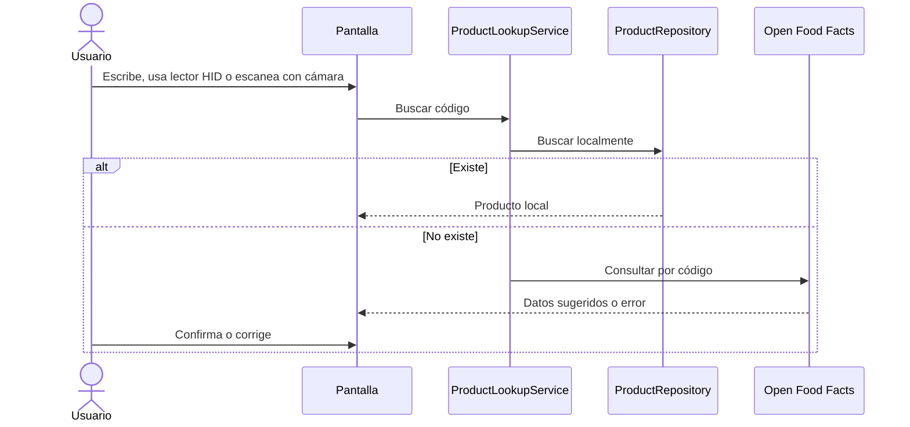

# Versión 0.6 — Códigos de barras, SKU y API

Periodo de trabajo: 29 de junio al 8 de julio de 2026  
Estado de la etapa: Incorporada con validación final pendiente de hardware  
Versión anterior: 0.5  
Siguiente versión: 0.7

## Punto de partida

Partimos del registro manual de la versión anterior. El problema era que capturar todo a mano seguía siendo lento y podía generar errores. Por eso trabajamos el flujo de código de barras, SKU y consulta externa.

## Captura de códigos

La evidencia final actualizada muestra cuatro formas relacionadas con código:

- Escritura manual del código.
- Compatibilidad indirecta con lectores HID, porque escriben en un campo de texto.
- Decodificación desde imagen seleccionada con `FilePicker`, SkiaSharp y ZXing.Net (`BarcodeScannerService.cs`).
- Escaneo en vivo con cámara mediante una página compartida y servicios por plataforma (`BarcodeScannerPage.xaml`, `BarcodeCameraPreview.cs`, `AndroidBarcodeCameraScannerService.cs`, `WindowsBarcodeCameraScannerService.cs`).

En la cronología reconstruida ubicamos la incorporación del escaneo por cámara dentro de la versión 0.6. La verificación técnica disponible se realizó durante la revisión final del 5 de agosto de 2026.

Android usa Camera2, `TextureView` e `ImageReader` con permiso `CAMERA`. Windows usa `DeviceInformation`, `MediaCapture`, `MediaFrameReader` y una vista integrada para no abrir la aplicación Cámara por separado. La selección de cámara se expone cuando el sistema reporta más de un dispositivo.

## Búsqueda local y consulta externa

Decidimos buscar primero localmente (`ProductLookupService.cs`). Si no se encuentra el producto, se consulta Open Food Facts (`ExternalProductService.cs`). Esta consulta usa `HttpClient`, JSON y timeout de 8 segundos.

## SKU y duplicados

El SKU quedó como dato obligatorio en dominio (`InventoryRules`). La unicidad se valida por negocio en repositorio y base de datos. La generación automática quedó parcial: la UI genera un SKU con prefijo `EXT-` cuando aceptamos datos externos y el campo está vacío (`NewItemPage.xaml.cs`).

## Validación EAN, UPC y GTIN

Encontramos validación de longitud y caracteres numéricos para códigos de 8, 12, 13 y 14 dígitos. También usamos `BarcodeRules.IsChecksumValid` para evitar consultas externas con dígito verificador inválido (`ExternalProductService.cs`). La búsqueda local se conserva antes de la consulta externa para no bloquear códigos ya registrados.

## Manejo de errores

La consulta externa captura errores de red, timeout, cancelación y JSON. Si el producto no aparece, el usuario puede seguir con captura manual. No encontramos una segunda API externa.

## Pruebas

En el estado final encontramos pruebas de duplicados, búsqueda por código, producto externo desconocido no guardado, lecturas repetidas, validación EAN/UPC/GTIN y bloqueo de consulta externa con checksum inválido. No ejecutamos prueba automatizada de hardware de cámara porque el proyecto no cuenta con pruebas UI ni simulación de cámara.

## Pendiente para la versión 0.7

Ya podíamos identificar productos, pero faltaba controlar correctamente entradas, salidas, ajustes, movimientos y conteos físicos.
